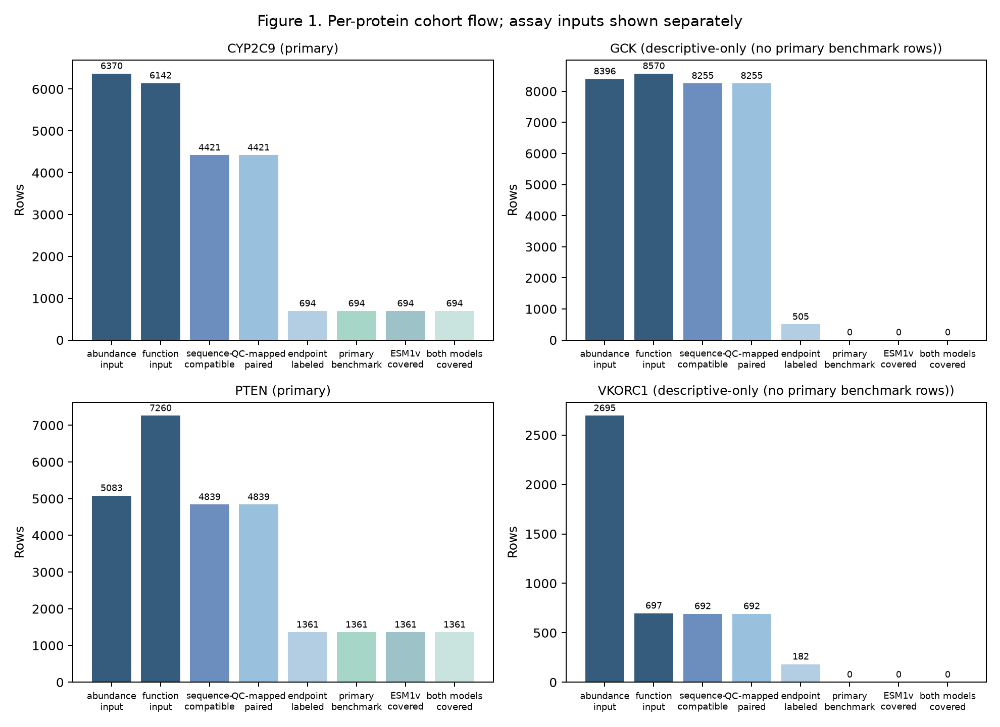
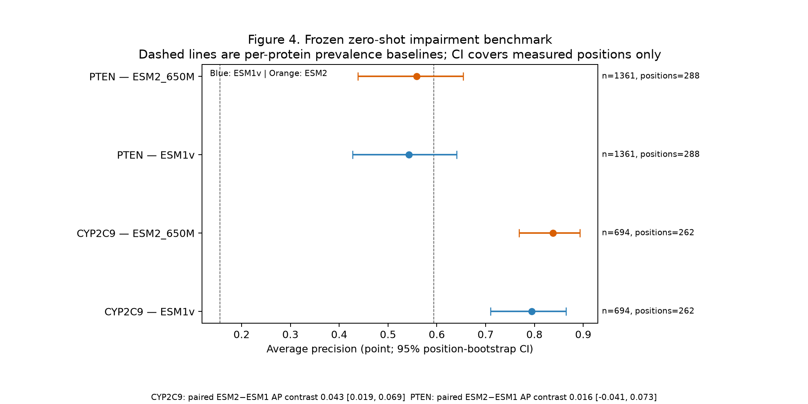
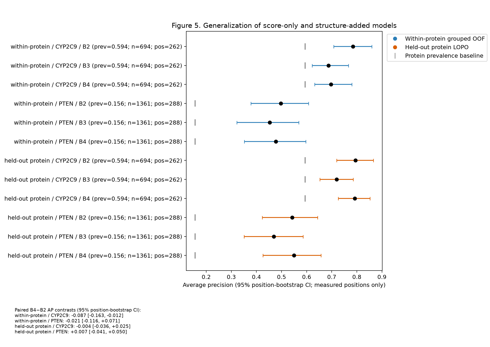

# Protein Assay Context

> **When measured abundance looks normal, can a protein still lose function? Can sequence models detect it?**

## Abstract

**Background.** Variant effect predictors are often evaluated against a single assay, even though protein abundance and protein function measure different biological consequences. A missense variant can preserve measured abundance yet impair a separate functional readout, creating a stringent test of whether a model captures functional constraint beyond gross abundance loss.

**Methods.** We paired abundance and function measurements from deep mutational scanning for 18,207 variants across CYP2C9, PTEN, GCK, and VKORC1. A frozen eligibility gate retained proteins with enough variants from both outcome classes and enough measured residue positions. ProteinGym ESM1v and ESM2 zero shot scores were evaluated among variants with preserved abundance using bootstrap intervals clustered by residue position. Learned comparisons used nested cross validation with residue positions kept together. Descriptors from experimental structures were added only inside folds designed to prevent leakage.

**Results.** CYP2C9 and PTEN passed the primary gate, yielding **2,055 variants across 550 measured residue positions**. ESM2 achieved average precision (AP) **0.838 versus prevalence 0.594** for CYP2C9 and **0.559 versus 0.156** for PTEN. ESM1v reached AP 0.794 and 0.543. Adding structure descriptors to the baseline based only on the ESM1v score changed AP within each protein by **−0.087 [−0.163, −0.012]** for CYP2C9 and **−0.021 [−0.116, 0.071]** for PTEN. Intervals for evaluation on a protein excluded from training included zero.

**Interpretation.** Pretrained sequence scores contain useful signal for functional impairment that is not reducible to measured abundance loss. In this benchmark, compact structure descriptors did not provide consistent incremental value. This evidence is specific to the assays studied. It does not establish clinical pathogenicity, a causal mechanism, protein stability, or a conclusion across the proteome.

## Study design



*Figure 1. Four cohorts with paired assays contributed 18,207 variants. Frozen gates for outcome class and residue position restricted confirmatory benchmarking to CYP2C9 and PTEN. GCK and VKORC1 remain descriptive.*

The primary endpoint is **impaired function versus preserved function among variants with preserved measured abundance**. Grouping every split and uncertainty calculation by residue position prevents substitutions at the same site from leaking across evaluation folds.

| Primary cohort | CYP2C9 | PTEN |
|---|---:|---:|
| Variants | 694 | 1,361 |
| Measured positions | 262 | 288 |
| Impaired / preserved | 412 / 282 | 212 / 1,149 |
| Prevalence | 0.594 | 0.156 |
| ESM1v AP | 0.794 | 0.543 |
| ESM2 AP | **0.838** | **0.559** |

## Main result: sequence models recover hidden functional loss



*Figure 4. Direct zero shot AP with 95% bootstrap intervals clustered by residue position. Prevalence is the reference level for each protein. The intervals describe variation over measured residue positions, not independent variants or assay uncertainty.*

The improvement above prevalence is especially pronounced for PTEN because variants with impaired function are relatively rare among those with preserved abundance. ESM2 exceeds ESM1v by **+0.0426 AP [0.0192, 0.0687]** for CYP2C9, while the PTEN contrast of **+0.0165 [−0.0408, 0.0730]** remains uncertain. The evidence therefore supports performance that depends on the protein rather than a universal ranking claim.

## Does structure add predictive value?



*Figure 5. Comparisons designed to prevent leakage assess feature sets based only on sequence and feature sets that also include structure. B2 and B4 use ESM1v. The direct ESM2 result above is a separate zero shot benchmark.*

Experimental structures mapped to 92.45% of CYP2C9 and 76.18% of PTEN reference positions. Nevertheless, adding accessibility, secondary structure, contact, confidence, and distance to functional sites did not consistently improve AP. This negative result is scientifically useful. Structural availability alone does not guarantee incremental predictive information, especially in a benchmark with only two proteins and incomplete residue coverage.

## Research safeguards

1. Cohorts, labels, score orientation, model comparison, and eligibility gates are frozen and checked by automated tests.
2. Model coverage is 100% for both primary proteins. Missing structural residues remain missing.
3. Nested evaluation keeps residue positions together and prevents leakage between substitutions at the same site.
4. Uncertainty uses 2,000 paired bootstrap draws by residue position, preserving measured positions as the sampling unit.
5. All raw tables and source derived tables at variant resolution remain outside the public Git history. Tracked results include only aggregates, figures, and provenance.

## Reproduce and audit

```powershell
uv sync --frozen
uv run python -m pytest -q
uv run ruff check src tests scripts
uv build
```

The offline test suite validates cohort contracts, canonical variant joins, grouped evaluation, deterministic bootstrap behavior, figure hashes, and exclusions from the public package. Reproducing the full analysis requires official inputs that are downloaded separately and verified by checksum.

[Detailed results](docs/RESULTS.md) · [Reproducibility](docs/REPRODUCIBILITY.md) · [Data provenance](docs/DATA_PROVENANCE.md) · [Limitations](docs/LIMITATIONS.md) · [Release checklist](docs/RELEASE_CHECKLIST.md) · [Novelty audit](docs/NOVELTY_AUDIT.md)

## Scope

This repository is a reproducible comparative case study conditioned on assay context. Only CYP2C9 and PTEN support the primary binary benchmark. GCK and VKORC1 are included only for descriptive analysis. The analysis does not establish clinical impact, molecular causality, allostery, stability, or generalization beyond the assayed proteins and experimental systems.

## License

Code is released under the [MIT License](LICENSE). Upstream datasets and structures retain their original terms and are not redistributed here.
